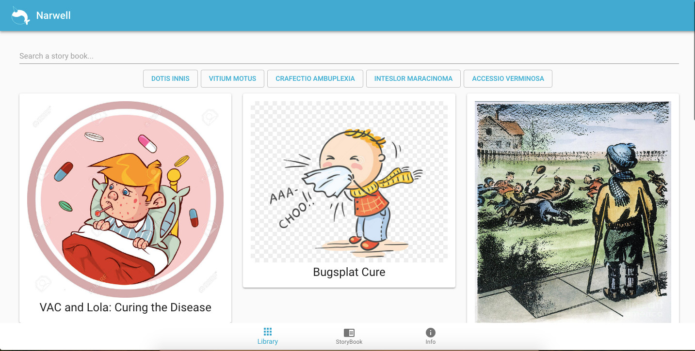
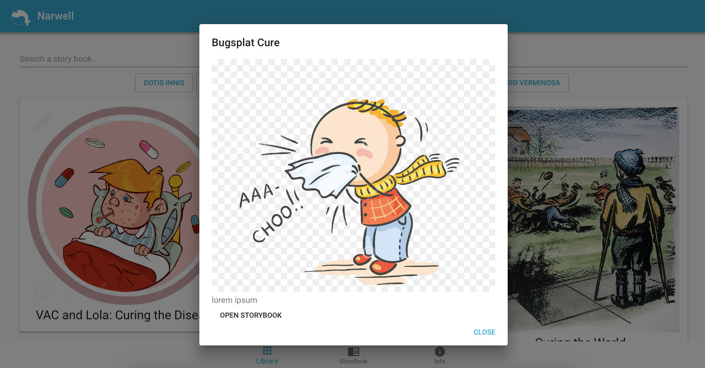

# Narwell :: 2018 GSKHackathon Project


***Demystifying information through patient engagement***


## About

Narwell is an informational-guided tour providing various interactive
scenarios that help inform patients decisions for that day’s procedure.

Take a look at our pitch!

- [Via Google Slides](https://docs.google.com/presentation/d/1JcQcFYAmtp1B0iffOQrPwQRRmcnKBRU6yscjPJ-VRXo/edit?usp=sharing)
- [Download PDF](resources/presentation/Narwell)

### Why?

Misinformation and easy accessibility to this information have enabled
self taught medical experts.


### How?

By targeting expecting parents and educating them though our interactive
platform.





## Setup

Clone the repository:

```
git clone https://github.com/jraleman/GSKHackathon narwhile
cd narwhile
```

Install all the dependencies needed:

```
cd App/
npm install
```

## Project Structure

The idea of having a good project structure is to have a cross platform project,
to maximize code reuse, keep the configurations out of the code, and minimize
the component state.

This is the main idea:

```
App/
├── package-lock.json
├── package.json
├── public
│   ├── assets
│   │   ├── picture.png
│   │   └── graphics.gif
│   ├── favicon.ico
│   ├── index.html
│   └── manifest.json
└── src
    ├── App.js
    ├── actions
    │   ├── constants.js
    │   └── index.js
    ├── components
    │   ├── AppHeader
    │   │   ├── AppHeader.js
    │   │   ├── index.js
    │   │   └── styles.js
    │   ├── AutoSuggest
    │   │   ├── AutoSuggest.js
    │   │   ├── index.js
    │   │   └── styles.js
    |   |  ...
    │   └── TabNavbar
    │       ├── TabNavbar.js
    │       ├── index.js
    │       └── styles.js
    ├── containers
    │   ├── InfoPageViewer
    │   │   ├── InfoPageViewer.js
    │   │   ├── index.js
    │   │   └── styles.js
    │   ├── LibraryPageViewer
    │   │   ├── LibraryPageViewer.js
    │   │   ├── index.js
    │   │   └── styles.js
    │   ├── RootContainer
    │   │   ├── index.js
    │   │   └── styles.css
    |   |  ...
    │   └── StoryPageViewer
    │       └── index.js
    ├── fixtures
    │   ├── index.js
    │   └── stories
    │       ├── gif
    │       │   └── pinkish-virus.gif
    │       ├── index.js
    │       └── json
    │           ├── storyEight.json
    |          ...
    │           └── storyOne.json
    ├── index.css
    ├── index.js
    ├── reducers
    │   ├── index.js
    │   ├── page.js
    │   └── story.js
    ├── registerServiceWorker.js
    └── themes
        ├── images
        │   ├── logo-alt.svg
        │   └── logo.svg
        └── index.js
```

### Project Structure Walkthrough

This is just a basic walkthrough to the project structure, walking through the
directories in more detail.

```
...
```

Work in progress. :)

## Style Guide

### Code

We follow the semistandard code style guide, based from [standard](https://github.com/standard/standard).

#### Setup

To install it, run:

```
npm install semistandard -g
```

or

```
npm run lint-install
```

#### Use

To use it, just run the following command:

```
npm run lint
```

This will print out the errors and/or warnings that your code might have.

#### Log

Run the following:

```
npm run lint-log
```

If you wish to save this into a log file.

### Colors

#### Primary (Narwell)


#### Secondary (Virus)


#### Dark / Light


#### Success / Error / Warning / Info


- [Material UI](https://material-ui.com/)

#### Font

- [Impact](https://www.wfonts.com/font/impact)
- [Roboto](https://fonts.google.com/specimen/Roboto)

#### Icons

- [Material Design Icons](https://materialdesignicons.com/)

## Contributors

- [Jose Ramón Aleman](https://github.com/jraleman)
- [Daniel Gonzalez](https://github.com/dannygonza)
- [Gerardo Malpartida](https://github.com/regien)
- [Felipe Romo](https://github.com/felromo)

## TODO

- [ ] [React Mansory component suport](https://github.com/eiriklv/react-masonry-component.git)

## Resources

1. ...
2. Work in Progress

## License

This project is under the Apache License. Meaning that you can use, copy, modify, merge, publish, distribute, sub-license, and/or sell copies of the final products, under some conditions. See the LICENSE file for more details.
